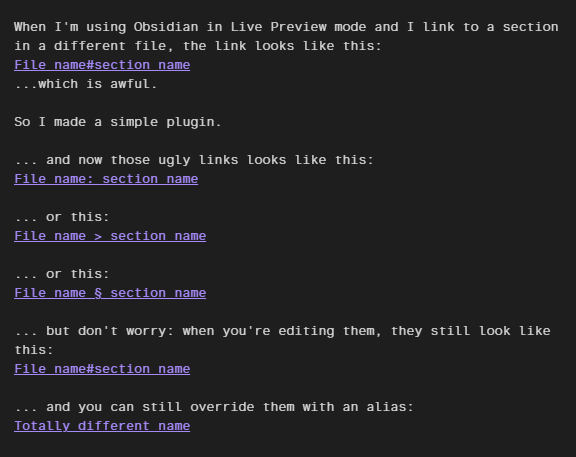

# Live Preview Heading Separator

An Obsidian plugin that makes links to headings readable in **Live Preview**.

By default, a section link like `[[Recipes#Bread]]` displays as `Recipes#Bread`
in Live Preview, which is hard to read. This plugin renders it as:

```
Recipes: Bread
```

...matching Obsidian's Reading view — and the separator is configurable, so you
can use ` > `, ` § `, `: `, or anything else you like.

## Screenshot




## Features

- Shows the raw `[[File#Heading]]` text again when your cursor enters the link,
  so editing behaves as normal
- Skips links that already have a manual alias (`[[File#Heading|My text]]`)
- Only affects display: Markdown files are never modified

## What it does *not* affect

- Reading mode (Obsidian already handles it there)
- Source mode
- How the link is displayed while editing it in Live Preview
- The contents of your notes on disk

## Known Issues

- When rendering a dead link, the separator uses normal active link formatting

## Installation

### Manual

1. Create the folder `<your vault>/.obsidian/plugins/obsidian-section-link-formatter/`
2. Copy `main.js` and `manifest.json` into it.
3. Restart or reload Obsidian.
4. Enable **Live Preview Heading Separator** in
   *Settings: Community plugins* (turn off Restricted mode if needed).

## License

MIT